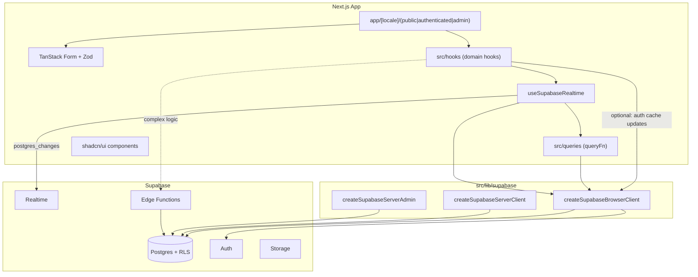

# SailingLoc — Project Overview and Guidelines

> Technical onboarding and enforcement guide for AI agents and developers working on this codebase.

---

## Rules of engagement

1. **Read this file before any work.** All conventions below are mandatory.
2. **Follow every rule.** Do not introduce patterns that contradict this document.
3. **Ask before building the unknown.** Do not implement features, UI flows, integrations, or architectural choices that are not described or implied by this file (or linked project docs) without **explicit user confirmation**. When in doubt, ask — do not assume. Do not add unrequested "helpful extras."
4. **Keep this file current.** Whenever the project changes structurally or conventionally, update `agent.md` in the **same PR/commit** so it stays accurate.

For business context (SailingLoc, team, legal disclaimer), see [README.md](README.md).  
For product requirements, see [documentation/](documentation/).

---

## Project context

**SailingLoc** is a peer-to-peer boat rental platform developed as an academic project (DEV DSP4 G3 2026). The company is fictional; no real transactions occur.

**Current state:** base scaffolding is complete. The following features are now implemented:
- **Public search page** (`/search`) with port/date/type filtering, sidebar filters (type, skipper, price, length, equipment), sort, pagination, and Realtime cache invalidation.
- **Landing page** with a hero search bar (TanStack Form + Zod) that prefills the search page.
- **Database-backed listing photography**: every boat cover and gallery shot is a `public.boat_media` row pointing at an object in the public `boat-images` bucket, resolved to a public URL through the Supabase client. Only brand chrome (landing hero, auth panel) remains a static asset.
- **Auth UI** (`/login`, `/register`) with email/password and Google OAuth callback.
- **Owner space** (`/owner/*`): dashboard, boat CRUD, availability calendar, contractual documents upload, draft→published gating; self-serve `/become-owner` (RENTER→OWNER).
- **Renter booking flow**: Stripe Checkout (test mode) via edge functions, booking history (`/bookings`), post-rental reviews tied to completed reservations, 10% platform commission recorded in DB.
- **Account profile** (`/profile`): edit name/phone; past (COMPLETED) reservations with linked review; list of comments and ratings left by the user (role not shown).
- **Admin back-office** (`/admin/*`): ADMINISTRATOR-gated back-office with the seven screens of the approved maquette — dashboard KPIs, users & roles (role assignment + account suspension), listing register, read-only reservation register, review moderation queue, payments & commissions, and an append-only admin action log.
- Supabase clients, i18n, theme, TanStack Query provider, `useSupabaseRealtime`, domain hooks for users/boats/owner/booking data.

---

## Technology stack


| Layer        | Choice                                                       |
| ------------ | ------------------------------------------------------------ |
| Framework    | Next.js 16 (App Router, React Compiler enabled)              |
| UI           | React 19, Tailwind CSS 4, shadcn/ui (`radix-nova` style)     |
| i18n         | `next-intl` — locales `en`, `fr`                             |
| Forms        | `@tanstack/react-form` + `zod`                               |
| Server state | `@tanstack/react-query` (15 min backup stale time)           |
| Backend      | Supabase (Auth, Postgres, Realtime, Storage, Edge Functions) |
| Theming      | `next-themes`                                                |


Key dependencies are in [package.json](package.json).

---

## Directory structure

```
src/
├── app/
│   ├── layout.tsx              # Root pass-through layout
│   ├── page.tsx                # Redirects to default locale
│   ├── globals.css             # Tailwind + shadcn CSS variables
│   └── [locale]/
│       ├── layout.tsx          # Providers: Query, i18n, theme, toaster
│       ├── not-found.tsx
│       ├── (public)/           # Unauthenticated routes
│       │   ├── page.tsx        # Home / landing page
│       │   ├── search/
│       │   ├── boats/[id]/
│       │   ├── login/
│       │   ├── register/
│       │   ├── become-owner/   # Self-serve RENTER → OWNER upgrade
│       │   ├── legal/          # Legal notice / Mentions légales
│       │   ├── terms/          # Terms of use and sale / CGU-CGV
│       │   ├── privacy/        # Privacy policy (GDPR) / RGPD
│       │   └── cookies/        # Cookie policy / Politique de cookies
│       ├── (authenticated)/
│       │   ├── bookings/       # Renter booking history + post-rental reviews
│       │   ├── profile/        # Account profile (view/edit name + phone)
│       │   └── owner/          # Owner space (OWNER/ADMIN gated in layout)
│       │       ├── page.tsx    # Dashboard
│       │       ├── boats/
│       │       ├── calendar/
│       │       ├── documents/
│       │       └── profile/
│       └── (admin)/            # Admin-only routes (ADMINISTRATOR gated in layout)
│           └── admin/
│               ├── layout.tsx  # Role gate + admin shell (header, sidebar, footer)
│               ├── page.tsx    # Dashboard
│               ├── users/      # Users & roles
│               ├── boats/      # Listing moderation
│               ├── reservations/
│               ├── moderation/ # Review moderation queue
│               ├── commissions/
│               └── security/   # Admin action log
├── components/
│   ├── ui/                     # shadcn primitives
│   ├── admin/                  # Admin shell + back-office feature components
│   ├── auth/
│   ├── boats/
│   ├── bookings/               # Bookings list + leave-review dialog
│   ├── profile/                # Authenticated profile page + reservation chat dialog
│   ├── brand/
│   ├── landing/
│   ├── layout/
│   ├── legal/                  # Legal document renderer + cookie consent banner
│   ├── owner/                  # Owner shell, dashboard, forms, calendar, documents
│   └── search/
├── constants/                  # Shared constants (e.g. TanstackQuery.ts)
├── contexts/                   # TanstackQueryClient, ThemeProvider
├── hooks/                      # Domain React Query hooks + useSupabaseRealtime
│   ├── useSupabaseRealtime.ts
│   ├── useCurrentUser.ts
│   ├── useCurrentUserRole.ts
│   ├── useBoats.ts
│   ├── useOwnerBoats.ts
│   ├── useOwnerDocuments.ts
│   ├── useBoatAvailabilitySlots.ts
│   ├── useBoatReservations.ts  # Active boat reservations + my bookings
│   ├── useBookingMutations.ts  # create-booking-checkout invoke
│   ├── useReviewMutations.ts   # Post-rental review insert
│   ├── useMyReviews.ts         # Reviews written by current user
│   ├── useProfileMutations.ts  # Update current user profile
│   ├── usePorts.ts
│   └── useOwnerMutations.ts    # create/update/publish boat, slots, documents, upgrade-to-owner
├── queries/
│   ├── fetchCurrentUser.ts
│   ├── fetchCurrentUserRole.ts
│   ├── fetchBoats.ts
│   ├── fetchOwnerBoats.ts
│   ├── fetchOwnerDocuments.ts
│   ├── fetchBoatAvailabilitySlots.ts
│   ├── fetchBoatReservations.ts
│   └── fetchPorts.ts
├── i18n/                       # routing, request, navigation
├── lib/
│   ├── utils.ts                # cn() helper
│   └── supabase/               # Client factories + generated types
│       └── updateSupabaseSession.ts  # Proxy session refresh helper
└── proxy.ts                    # Session refresh + route whitelist + locale routing

messages/                       # en.json, fr.json (project root)
public/images/brand/            # Static brand chrome only (landing hero, auth panel)
scripts/
└── seed-boat-media.mjs         # Uploads listing photography and writes boat_media rows
supabase/
├── config.toml                 # Local + storage + per-function edge config
├── migrations/                 # SQL migrations
├── seeds/                      # Modular local fixtures (01-08, glob-loaded; not for production)
│   └── assets/boat-images/     # Demo listing photography + media.json manifest
└── functions/
    ├── create-booking-checkout/  # JWT required — PENDING reservation + Stripe Checkout
    │   ├── index.ts
    │   └── deno.json
    └── stripe-webhook/           # Public webhook — confirm/cancel reservation
        ├── index.ts
        └── deno.json
```

**Path alias:** `@/`* → `src/`* ([tsconfig.json](tsconfig.json)).

---

## Architecture overview




---

## App routing conventions

- All user-facing routes live under `[src/app/[locale]/](src/app/[locale]/)`.
- Three **route groups** (parentheses = no URL segment):
  - `(public)` — marketing, auth pages, unauthenticated flows
  - `(authenticated)` — renter/owner dashboards, profile, bookings
  - `(admin)` — administrator-only management
- Locale handling:
  - `[src/i18n/routing.ts](src/i18n/routing.ts)` — `en` / `fr`, default `en`
  - `[src/i18n/request.ts](src/i18n/request.ts)` — loads `[messages/{locale}.json](messages/en.json)`
  - `[src/i18n/navigation.ts](src/i18n/navigation.ts)` — locale-aware `Link`, `redirect`, `useRouter`
  - `[src/proxy.ts](src/proxy.ts)` — Next.js 16 proxy (replaces deprecated `middleware.ts`) for session refresh, route protection, and locale detection
  - `[src/lib/supabase/updateSupabaseSession.ts](src/lib/supabase/updateSupabaseSession.ts)` — Supabase client for proxy; refreshes auth cookies via `getUser()`

#### Proxy route whitelist

Route groups do **not** appear in URLs. Every page must be registered explicitly in one of three arrays at the top of `[src/proxy.ts](src/proxy.ts)`:


| Array                  | Access                                                          |
| ---------------------- | --------------------------------------------------------------- |
| `PUBLIC_ROUTES`        | Anyone (no auth required)                                       |
| `AUTHENTICATED_ROUTES` | Logged-in Supabase user required                                |
| `ADMIN_ROUTES`         | Logged-in user with `ADMINISTRATOR` role in `public.user_roles` |


**Current public routes:** `/`, `/login`, `/register`, `/search`, `/boats`, `/become-owner`, `/legal`, `/terms`, `/privacy`, `/cookies`.

**Current authenticated routes:** `/owner`, `/bookings`, `/profile`.

**Current admin routes:** `/admin`. `matchesRoute` prefix-matches, so the single `/admin` entry covers every admin sub-page (`/admin/users`, `/admin/boats`, …) — do not add one entry per screen.

**Defence in depth:** the proxy matcher excludes `/api` and short-circuits `/auth`, so proxy gating is not sufficient on its own. Every admin route re-checks the role server-side in `[src/app/[locale]/(admin)/admin/layout.tsx](src/app/[locale]/(admin)/admin/layout.tsx)` (unauthenticated → `/login`, non-ADMINISTRATOR → `/`), mirroring the owner layout.

**Default deny:** paths not listed in any array redirect to `/{locale}` (home). When adding a page under `(public)`, `(authenticated)`, or `(admin)`, add its locale-stripped path (e.g. `/dashboard`, `/login`) to the matching array in the same change.

All UI strings MUST use `next-intl` with keys in the `messages/` JSON files. Do not hardcode user-facing text.

---

## Conventions

### Forms

- **MUST** use `@tanstack/react-form` with a `zod` schema for validation.
- Do **not** use raw `useState` for production form state.

### CRUD and data fetching

- All Supabase CRUD **MUST** go through the client factories in `[src/lib/supabase/](src/lib/supabase/)`:
  - `createSupabaseBrowserClient` — client components
  - `createSupabaseServerClient` — server components / server actions
  - `createSupabaseServerAdmin` — privileged server-only ops (`NEXT_PRIVATE_SUPABASE_ADMIN_KEY`)

#### Queries vs hooks

Data fetching is split across two layers:


| Layer                          | Responsibility                                                                                                                                                                                       | Example                                        |
| ------------------------------ | ---------------------------------------------------------------------------------------------------------------------------------------------------------------------------------------------------- | ---------------------------------------------- |
| `[src/queries/](src/queries/)` | Pure async functions passed as `queryFn` to TanStack Query. Perform Supabase calls via client factories. **Throw on error.** No React hooks, no Realtime subscriptions.                              | `fetchCurrentUser()`, `fetchCurrentUserRole()` |
| `[src/hooks/](src/hooks/)`     | React hooks consumed by components. Export query-key constants. Call `useSupabaseRealtime({ queryKey, queryFn, realtimeSubscriptions })`. May add domain-specific cache logic (e.g. auth listeners). | `useCurrentUser()`, `useCurrentUserRole()`     |


Canonical example:

```ts
// src/queries/fetchCurrentUser.ts
// All queries should always have a predefined return type
export async function fetchCurrentUser(): Promise<ExpectedResultHere> {
  // supabase call via createSupabaseBrowserClient; throw on error
}

// src/hooks/useCurrentUser.ts
export const CURRENT_USER_QUERY_KEY = ["current-user"] as const;

export function useCurrentUser() {
  return useSupabaseRealtime({
    queryKey: CURRENT_USER_QUERY_KEY,
    queryFn: fetchCurrentUser,
    realtimeSubscriptions: [{ table: "users", filter: `auth_id=eq.${authId}` }],
  });
}
```

- Wrap each resource in a dedicated hook under `[src/hooks/](src/hooks/)` using `@tanstack/react-query`.
- **All Supabase DB hooks MUST use `useSupabaseRealtime` for cache invalidation.** Any hook that reads Supabase data must call `useSupabaseRealtime`, passing the query keys it manages, so that when the underlying data is modified (insert, update, delete), the hook's cached data is invalidated automatically. Do **not** write raw `supabase.channel()` subscriptions in components or data hooks, and do not use manual polling.

#### Query client defaults

Configured in `[src/contexts/tanstack-query-client.tsx](src/contexts/tanstack-query-client.tsx)` using `DEFAULT_TANSTACK_QUERY_STALE_TIME_IN_MS` from `[src/constants/TanstackQuery.ts](src/constants/TanstackQuery.ts)`:

- `staleTime: 15 * 60 * 1000` (15 min backup invalidation only — not the primary refresh mechanism)
- Primary invalidation via `useSupabaseRealtime` (Postgres changes) — not polling

#### `useSupabaseRealtime` contract

`useSupabaseRealtime` in `[src/hooks/useSupabaseRealtime.ts](src/hooks/useSupabaseRealtime.ts)` is the **single shared primitive** for Postgres Realtime cache invalidation:

- Called directly inside each data hook that needs invalidation (not mounted at the root layout)
- Encapsulates all Supabase Realtime subscription logic in one place
- Runs `useQuery` with caller-provided `queryKey`, `queryFn`, and optional `enabled`
- Subscribes to `postgres_changes` per `realtimeSubscriptions` entry
- Calls `queryClient.invalidateQueries({ queryKey })` when matching DB events occur
- Domain hooks pass their query keys per invocation; they do not implement Realtime subscriptions themselves
- Use exported types (`RealtimeSubscription`, filter string format) so table/column names stay aligned with `[src/lib/supabase/database.types.ts](src/lib/supabase/database.types.ts)`
- The `filter` field is **mandatory**. To subscribe to every row in a table, use the nil-UUID sentinel: `` filter: `id=neq.${NIL_UUID}` `` with `NIL_UUID` imported from `[src/constants/Realtime.ts](src/constants/Realtime.ts)`

#### Realtime publication membership (important)

A `useSupabaseRealtime` subscription only ever fires for tables that are members of the Postgres `supabase_realtime` publication. A subscription on an unpublished table connects successfully and then **silently never invalidates**.

Current members: `reservation_messages`, `users`, `user_roles`, `boats`, `payment_transactions`, `admin_audit_log`, `boat_reviews`, `boat_media`.

`postgres_changes` honours RLS — a subscriber receives a row only if their own SELECT policies permit reading it (verified: a RENTER does not receive other users' `public.users` changes, an ADMINISTRATOR does). Publishing a table therefore does not widen access, but it does mean **every table added to the publication must have a correct SELECT policy first**.

`public.boat_reservations` is deliberately **excluded**: its only SELECT policy is `for select to anon, authenticated using (true)`, so publishing it would broadcast every booking (renter, dates, amount) to every connected client. Hooks reading reservations subscribe to `payment_transactions` instead and otherwise refresh on load / staleTime. Tightening that policy is tracked as separate work.

When adding a table to the publication, do it in the migration that introduces the table (or its admin policies), and record it above.

#### Auth cache updates

Auth-driven cache updates are **not** handled inside `useSupabaseRealtime`. When a domain hook needs auth-aware cache behavior, add it in the domain hook itself. Reference patterns: `[src/hooks/useCurrentUser.ts](src/hooks/useCurrentUser.ts)` and `[src/hooks/useCurrentUserRole.ts](src/hooks/useCurrentUserRole.ts)` use `supabase.auth.onAuthStateChange` to `setQueryData(null)` on `SIGNED_OUT` and `invalidateQueries` on `SIGNED_IN`, `TOKEN_REFRESHED`, or `USER_UPDATED`.

#### Admin list screens: server-side filtering

Admin tables filter, sort and paginate **server-side through PostgREST**, not in the browser — `.or()` + `.ilike` for search, `.eq()` for filters, `.order()` for sorting, `.range()` + `{ count: "exact" }` for pagination. No per-screen RPC is needed because the admin SELECT policies already scope the rows.

- Shared types and helpers live in `[src/types/AdminList.ts](src/types/AdminList.ts)`: `AdminListParams`, `PaginatedAdminList`, `pageToRange()`, `buildPaginatedResult()`, `sanitizeSearchTerm()`.
- `sanitizeSearchTerm()` strips `,` `(` `)` because PostgREST parses `.or()` as a comma-separated list — an unescaped comma in a user's search term corrupts the filter expression.
- Filtering on an **embedded** table requires `!inner`, otherwise PostgREST returns the parent row with a null embed instead of excluding it.
- PostgREST **cannot order a parent table by an embedded column**, so each screen exports an explicit `ADMIN_*_SORT_COLUMNS` tuple of own columns only. Do not add a sortable header for a joined field.
- Filters are part of the query key (`build<Domain>QueryKey(filters)`), so each combination caches independently — same convention as `buildBoatsQueryKey`.
- Shared UI: `admin-table-toolbar.tsx` (debounced search + filter selects + result count), `admin-sortable-header.tsx` (sets `aria-sort`), `admin-pagination.tsx`, and the `use-admin-filters.ts` state controller (any non-paging change resets to page 1).
- GIN **trigram** indexes back the ILIKE lookups (`pg_trgm`, migration `20260803044428`). Add one for any new searchable text column.
- Summary figures that must reflect the whole dataset (e.g. commission totals) use a **separate hook**, so they do not change while paging a filtered table.

#### Query-key naming convention

- Export query-key constants from the domain hook file (e.g. `CURRENT_USER_QUERY_KEY = ["current-user"] as const`, `CURRENT_USER_ROLE_QUERY_KEY = ["current-user-role"] as const`)
- `['users', userId]` — single user
- `['boats', 'list', filters]` — paginated boat search (`BOATS_LIST_QUERY_KEY_PREFIX` exported from `src/hooks/useBoats.ts`)
- `['bookings', bookingId]`
- Use a consistent `[resource, ...identifiers]` pattern

**Implemented domain hooks:**

| Hook | File | Query key |
| ---- | ---- | --------- |
| `useCurrentUser` | `src/hooks/useCurrentUser.ts` | `["current-user"]` |
| `useCurrentUserRole` | `src/hooks/useCurrentUserRole.ts` | `["current-user-role"]` |
| `useBoats(filters)` | `src/hooks/useBoats.ts` | `["boats", "list", filters]` |
| `useOwnerBoats` | `src/hooks/useOwnerBoats.ts` | `["owner-boats"]` |
| `useOwnerDocuments` | `src/hooks/useOwnerDocuments.ts` | `["owner-documents"]` |
| `useOwnerAvailabilitySlots` / `useBoatAvailabilitySlots` | `src/hooks/useBoatAvailabilitySlots.ts` | `["owner-availability"]` / `["boat-availability", boatId]` |
| `usePorts` | `src/hooks/usePorts.ts` | `["ports"]` |
| `useBoatActiveReservations(boatId)` | `src/hooks/useBoatReservations.ts` | `["bookings", "boat", boatId]` |
| `useMyReservations` | `src/hooks/useBoatReservations.ts` | `["bookings", "mine"]` |
| `useReservationMessages(reservationId)` | `src/hooks/useReservationMessages.ts` | `["reservation-messages", reservationId]` |
| `useAdminPlatformStats` | `src/hooks/useAdminPlatformStats.ts` | `["admin-stats"]` |
| `useAdminUsers(filters)` | `src/hooks/useAdminUsers.ts` | `["admin-users", "list", filters]` |
| `useAdminBoats(filters)` | `src/hooks/useAdminBoats.ts` | `["admin-boats", "list", filters]` |
| `useAdminReservations(filters)` | `src/hooks/useAdminReservations.ts` | `["admin-reservations", "list", filters]` |
| `useAdminPayments(filters)` | `src/hooks/useAdminPayments.ts` | `["admin-payments", "list", filters]` |
| `useAdminAuditLog` | `src/hooks/useAdminAuditLog.ts` | `["admin-audit"]` |
| `useAdminReviews(filters)` | `src/hooks/useAdminReviews.ts` | `["admin-reviews", "list", filters]` |
| `useAdminFlaggedReviewCount` | `src/hooks/useAdminFlaggedReviewCount.ts` | `["admin-flagged-reviews"]` |
| `useAdminPaymentTotals` | `src/hooks/useAdminPaymentTotals.ts` | `["admin-payment-totals"]` |
| `useAdminGlobalSearch(query)` | `src/hooks/useAdminGlobalSearch.ts` | `["admin-global-search", query]` |

Each admin hook also exports a `ADMIN_*_QUERY_KEY_PREFIX` constant. Mutation hooks MUST import those constants rather than re-declaring key literals.

**Implemented query functions:**

| Function | File | Purpose |
| -------- | ---- | ------- |
| `fetchCurrentUser` | `src/queries/fetchCurrentUser.ts` | Authenticated user profile |
| `fetchCurrentUserRole` | `src/queries/fetchCurrentUserRole.ts` | Current user role |
| `fetchBoats(filters)` | `src/queries/fetchBoats.ts` | Calls `search_available_boats` RPC; returns `PaginatedBoats` whose rows carry a resolved `coverImage` |
| `fetchBoatFilterBounds(port)` | `src/queries/fetchBoats.ts` | Calls `get_boat_filter_bounds` RPC for slider bounds |
| `fetchOwnerBoats` / `fetchOwnerBoatById` | `src/queries/fetchOwnerBoats.ts` | Owner fleet (+ port join) |
| `fetchOwnerDocuments` | `src/queries/fetchOwnerDocuments.ts` | Owner contractual documents |
| `fetchBoatAvailabilitySlots` / `fetchOwnerAvailabilitySlots` | `src/queries/fetchBoatAvailabilitySlots.ts` | Availability windows |
| `fetchBoatActiveReservations` / `fetchMyReservations` | `src/queries/fetchBoatReservations.ts` | Active boat bookings / renter history |
| `fetchReservationMessages` | `src/queries/fetchReservationMessages.ts` | Chat messages for one reservation |
| `fetchPorts` | `src/queries/fetchPorts.ts` | Port options for forms |
| `fetchAdminPlatformStats` | `src/queries/fetchAdminPlatformStats.ts` | Calls `admin_platform_stats` RPC (dashboard KPIs) |
| `fetchAdminUsers` | `src/queries/fetchAdminUsers.ts` | All users + role + `canBePromoted` (email & phone present) |
| `fetchAdminBoats` | `src/queries/fetchAdminBoats.ts` | All boats incl. drafts, + owner and port |
| `fetchAdminReservations` | `src/queries/fetchAdminReservations.ts` | All reservations + boat, renter and payment status |
| `fetchAdminPayments` | `src/queries/fetchAdminPayments.ts` | Payment rows + computed commission totals |
| `fetchAdminAuditLog` | `src/queries/fetchAdminAuditLog.ts` | Last 200 admin audit entries + actor |
| `fetchAdminReviews` | `src/queries/fetchAdminReviews.ts` | All reviews + boat + reviewer, for moderation |

**Implemented mutation hooks (non-Realtime):**

| Hook | File | Purpose |
| ---- | ---- | ------- |
| `useCreateBookingCheckout` | `src/hooks/useBookingMutations.ts` | Invokes `create-booking-checkout` edge function |
| `useCreateBoatReview` | `src/hooks/useReviewMutations.ts` | Inserts review for a COMPLETED reservation |
| `useUpdateCurrentUser` | `src/hooks/useProfileMutations.ts` | Updates own `users` profile (name, phone) |
| `useSendReservationMessage` | `src/hooks/useReservationMessages.ts` | Inserts a chat message on a reservation |
| `useMyReviews` | `src/hooks/useMyReviews.ts` | Reviews written by the current user |
| `useOwnerMutations` (multiple) | `src/hooks/useOwnerMutations.ts` | Boat CRUD, slots, documents, upgrade-to-owner |
| `useAdminSetUserRole` / `useAdminSetUserStatus` / `useAdminModerateReview` / `useAdminSetBoatPublished` | `src/hooks/useAdminMutations.ts` | Call the admin RPCs; `mapAdminMutationError()` maps sentinel codes to translation keys |

### Edge functions

Use edge functions for logic beyond simple CRUD: payments, commissions, multi-table transactions, external APIs.

- **MUST** be created and deployed via Supabase CLI.
- **Per-function `deno.json`** (mandatory): each function folder under `supabase/functions/<name>/` owns its own `deno.json`. Do **not** use a shared root `supabase/functions/deno.json` for deployment.
- **Per-function `config.toml` entry** (mandatory): every edge function **MUST** have a matching `[functions.<name>]` block in `[supabase/config.toml](supabase/config.toml)`. At minimum, set `verify_jwt` (default `true`; set `false` only for public webhooks). Add `entrypoint` or `import_map` only when deviating from the default `index.ts` / `deno.json` layout.

Example layout:

```
supabase/functions/create-booking-checkout/
├── index.ts
└── deno.json

supabase/functions/stripe-webhook/
├── index.ts
└── deno.json
```

Example config:

```toml
# supabase/config.toml
[functions.create-booking-checkout]
verify_jwt = true

[functions.stripe-webhook]
verify_jwt = false
```

**Implemented edge functions:**

| Function | `verify_jwt` | Purpose |
| -------- | ------------ | ------- |
| `create-booking-checkout` | `true` | Authenticated renter: validate dates, insert PENDING reservation, create Stripe Checkout Session, insert `payment_transactions` with 10% commission split, return checkout URL |
| `stripe-webhook` | `false` | Stripe signature verification; `checkout.session.completed` → CONFIRMED/PAID; `checkout.session.expired` → CANCELLED/EXPIRED |

Local secrets for edge functions live in `supabase/functions/.env` (gitignored). See `supabase/functions/.env.example`. Local webhook testing: `stripe listen --forward-to http://127.0.0.1:54321/functions/v1/stripe-webhook`.

**Checklist when adding a new edge function:**

1. `npx supabase functions new <name>` — scaffolds `supabase/functions/<name>/index.ts`
2. Add/edit `supabase/functions/<name>/deno.json` with that function's dependencies
3. Add `[functions.<name>]` to `supabase/config.toml`
4. Test locally: `npx supabase functions serve <name>`
5. Deploy: `npx supabase functions deploy <name>`

### Database changes

- **Only** via Supabase CLI migrations: `supabase migration new <name>` → edit SQL in `[supabase/migrations/](supabase/migrations/)` → `supabase db push` / `supabase migration up`.
- **RLS is mandatory on first creation:** any new PostgreSQL object (tables, API-exposed views) **MUST** include RLS policies in the **same migration** that creates it. Never add a table and defer policies to a follow-up migration.
  - `ALTER TABLE ... ENABLE ROW LEVEL SECURITY` in the creation migration
  - Explicit `CREATE POLICY` for each required operation (`SELECT`, `INSERT`, `UPDATE`, `DELETE`)
  - Postgres requires a `SELECT` policy for `UPDATE` to work under RLS
  - Policies MUST match the real access model (role-based, ownership via `auth.uid()`, etc.)
  - Use `SECURITY DEFINER` functions only when necessary; keep them out of exposed schemas where possible

**Checklist when adding a new table:**

1. `npx supabase migration new <name>`
2. `CREATE TABLE` + indexes/constraints
3. `ENABLE ROW LEVEL SECURITY` + all `CREATE POLICY` statements in the same file
4. Regenerate TypeScript types (see below)

**Current schema:**

| Table | Description | RLS |
| ----- | ----------- | --- |
| `public.users` | Profile linked to `auth.users` | Users can view/update own row (`GRANT` select/update to `authenticated`) |
| `public.user_roles` | Role enum: `VISITOR`, `RENTER`, `OWNER`, `ADMINISTRATOR` | Users can view own role (`GRANT` select to `authenticated`) |
| `public.ports` | Rental ports (name, country) | Public SELECT |
| `public.boats` | Boats listed for rental (`is_published` default false for new rows) | Public SELECT published + own; owner INSERT/UPDATE/DELETE |
| `public.boat_reviews` | Reviews left by renters on boats (`reviewer_id`, optional unique `reservation_id`, `moderation_status`/`moderated_at`/`moderated_by`) | **Two** permissive SELECT policies: `to anon, authenticated using (moderation_status <> 'REJECTED')` and an admin-only `to authenticated using (private.is_administrator())`. Authenticated INSERT for own COMPLETED reservation. **No UPDATE policy or grant** — moderation goes through `admin_moderate_review()` |
| `public.boat_availability_time_slots` | Date windows when a boat is available | Public SELECT; owner write |
| `public.boat_reservations` | Bookings with `status`; active ones block availability | Public SELECT; writes via service-role edge functions only |
| `public.boat_equipment_links` | Junction: boat ↔ `boat_equipment` enum | Public SELECT |
| `public.payment_transactions` | Stripe payment records per reservation (`commission_amount`, `owner_amount`) | Renter/owner/admin SELECT; writes service-role only |
| `public.boat_media` | Listing photography (`boat-images` bucket). `kind` (`boat_media_kind`) drives the localized alternative text and the gallery order; `focal_point` is the CSS `object-position` used when the crop is tight. `is_cover` is kept in sync with `kind` by `boat_media_cover_matches_kind`, one cover per boat, and `(boat_id, storage_path)` is unique | Public SELECT; owner/admin write |
| `public.boat_documents` | Contractual docs (`boat-documents` bucket). `LICENSE`/`SAILOR_CV` are owner-level (`boat_id` null); `INSURANCE` is boat-scoped | Owner/admin only |
| `public.reservation_messages` | Renter ↔ owner chat scoped to a reservation | Participants (renter, boat owner, admin) SELECT/INSERT via `private.is_reservation_participant` |
| `public.admin_audit_log` | Append-only trace of privileged admin actions (`actor_user_id` + `actor_email_snapshot`, `action`, `target_table`, `target_id`, `details` jsonb) | Admin SELECT only. **No INSERT/UPDATE/DELETE policy or grant exists at all** — rows are written solely by `private.record_admin_action()` running as SECURITY DEFINER, so an administrator cannot forge or erase history |

Column additions: `boats.is_published` / `published_at` (publish gated by required documents), `ports.slug` (unique, kebab-case), `boat_reservations.status` / `total_amount` / `currency`, `payment_transactions.commission_amount` / `owner_amount`, `boat_reviews.reservation_id`.

**Enums:** `boat_type` (`SAILBOAT`, `MOTORBOAT`, `CATAMARAN`, `YACHT`), `boat_skipper_option` (`INCLUDED`, `OPTIONAL`, `NONE`), `boat_equipment` (`GPS`, `SLEEPING_BERTHS`, `EQUIPPED_KITCHEN`), `reservation_status` (`PENDING`, `CONFIRMED`, `CANCELLED`, `COMPLETED`), `boat_document_type` (`INSURANCE`, `REGISTRATION`, `LICENSE`, `OTHER`, `SAILOR_CV`), `boat_media_kind` (`COVER`, `COCKPIT`, `INTERIOR`, `ONBOARD`, `EXTERIOR`), `user_account_status` (`ACTIVE`, `PENDING`, `SUSPENDED` — `PENDING` is reserved and nothing sets it), `admin_action_type` (`SET_USER_ROLE`, `SET_USER_STATUS`, `MODERATE_REVIEW`, `PUBLISH_BOAT`, `UNPUBLISH_BOAT`).

#### Admin write model (important)

Administrators get **no direct DML policy** on `public.users` or `public.user_roles`. Every privileged mutation goes through a `SECURITY DEFINER` RPC that authorizes, enforces preconditions, and writes its own audit row in one transaction:

| RPC | Guards |
| --- | ------ |
| `public.admin_set_user_role(p_user_id, p_role)` | Caller must be admin; refuses self-targeting (`ADMIN_ROLE_SELF_CHANGE`); pre-checks the email+phone rule and raises `ADMIN_ROLE_PRECONDITION_CONTACT` so the UI can translate it instead of surfacing the raw `check_role_requirements` message. No status precondition on the target — demoting a suspended account must stay possible. |
| `public.admin_set_user_status(p_user_id, p_status)` | Caller must be admin; refuses self-targeting (`ADMIN_STATUS_SELF_CHANGE`) because that would be an unrecoverable lockout; on `SUSPENDED` it also unpublishes every boat owned by the target in the same transaction. |
| `public.admin_set_boat_published(p_boat_id, p_is_published)` | Caller must be admin. Unpublishing is unconditional; republishing still re-runs `enforce_boat_publish_requirements` (owner LICENSE + SAILOR_CV + boat INSURANCE) and its exception propagates so the UI can explain the refusal. |
| `public.admin_moderate_review(p_review_id, p_status)` | Caller must be admin; sets `moderation_status`/`moderated_at`/`moderated_by` and writes an audit row. `REJECTED` hides the review from non-admins and drops it from `boats.rating`; `FLAGGED` is triage only and stays publicly visible. |

**Review moderation is POST-moderation:** a review publishes the instant the renter submits it (unchanged behaviour) and `moderation_status` defaults to `APPROVED`, so no existing row changes visibility.

**Why two SELECT policies on `boat_reviews` instead of one OR-ed expression:** `private.is_administrator()` has EXECUTE revoked from `anon`. Naming it inside a policy that applies `to anon` risks `permission denied for function is_administrator` on public boat pages. Permissive policies are OR-ed by Postgres, so splitting keeps the anonymous path from ever referencing the helper. Apply the same rule to any future anon-facing policy.

**PostgREST embed hint required:** `boat_reviews` now has two FKs to `public.users` (`reviewer_id`, `moderated_by`), so a bare `users(...)` embed fails with `PGRST201`. Use `users!boat_reviews_reviewer_id_fkey(...)`.

`private.is_administrator()` requires `role = 'ADMINISTRATOR'` **and** `account_status = 'ACTIVE'`, so suspending an administrator actually removes their power.

**Column-scoped grant:** `authenticated` holds `UPDATE (first_name, last_name, phone)` on `public.users` — **not** table-wide UPDATE. Postgres has no per-column RLS, so without this narrowing a suspended member could PATCH `account_status` back to `ACTIVE` themselves. If a new self-service profile field is added, extend this grant in the same migration or the write will fail.

**Admin access:** migration `20260803030811` adds permissive SELECT policies `"Admins can view all users"` and `"Admins can view all user roles"` (both `private.is_administrator()`), leaving the existing own-row policies untouched. Admin **write** access to `public.users` / `public.user_roles` is deliberately NOT opened — role and status changes go through SECURITY DEFINER RPCs so they are guarded and audited in one place.

**RPCs:** `admin_global_search(p_query, p_limit)` — cross-entity admin lookup (users, boats, reviews) backing the header search field; `admin_platform_stats()` — administrator-only dashboard KPIs (members, live listings, bookings this month, commission this month); `plpgsql` with an explicit `raise ... errcode 42501` guard rather than a WHERE predicate, because an aggregate-only query with a WHERE guard returns a row of zeros to a non-admin instead of failing; `search_available_boats(...)` — paginated boat search with availability/date filtering (only `is_published` boats; blocks on `PENDING`/`CONFIRMED` reservations). It also flattens the cover image onto each row (`cover_storage_bucket`, `cover_storage_path`, `cover_focal_point`, `cover_alt_text`) via a `left join lateral`, so the grid never issues a second query per page and a listing without photography still appears; `get_boat_filter_bounds(p_port_name)` — returns min/max price and length for sidebar sliders; `upgrade_current_user_to_owner()` — promotes authenticated `RENTER` → `OWNER` (email+phone already enforced by role trigger).

**Constraints:** `boat_reservations_no_overlap` — `btree_gist` exclusion constraint preventing overlapping active (`PENDING`/`CONFIRMED`) reservations on the same boat. Unique partial indexes: one `LICENSE` and one `SAILOR_CV` per owner; one `INSURANCE` per boat. Unique `boat_reviews.reservation_id` (one review per rental).

Triggers: timestamp enforcement, role requirements (email + phone for elevated roles), auto-provision on auth signup/update, `recompute_boat_rating` (keeps `boats.rating` = average of its reviews), `enforce_boat_document_owner` (document scoping rules), `enforce_boat_publish_requirements` (blocks `is_published → true` without LICENSE + SAILOR_CV + boat INSURANCE).

**`private` schema:** houses `SECURITY DEFINER` helpers kept out of the API-exposed `public` schema. Helpers: `private.is_administrator()`, `private.current_public_user_id()`, `private.is_boat_owner(boat_id)`, `private.is_reservation_participant(reservation_id)` (renter, boat owner, or admin), `private.complete_finished_reservations()` (CONFIRMED→COMPLETED when `end_date` passed; stale PENDING→CANCELLED after 24h). Scheduled daily via `pg_cron` job `complete-finished-reservations`.

**Service role grants:** `service_role` has `SELECT/INSERT/UPDATE/DELETE` on all `public` tables (required by booking edge functions). Without these grants, Checkout fails with `permission denied for table users`.

After any migration, regenerate types:

```bash
npx supabase gen types typescript --local --schema public > src/lib/supabase/database.types.ts
```

> `--local` is required by Supabase CLI v2 (it also accepts `--linked` / `--project-id` / `--db-url`). Without it the command fails **and the shell redirect still truncates `database.types.ts` to the error JSON** — check `git diff` after regenerating.

> **Note:** [README.md](README.md) references `supabase/database.types.ts`. The canonical path in this project is `src/lib/supabase/database.types.ts`.

### Local seed data

Use the modular files in `[supabase/seeds/](supabase/seeds/)` for **local testing only** — fixture users, sample boats, bookings, etc. Do **not** put seed data in migrations.

- Loaded via `[supabase/config.toml](supabase/config.toml)` `[db.seed]` glob (`sql_paths = ["./seeds/*.sql"]`, `enabled = true`). Files run **alphabetically**, hence the numeric prefixes:
  - `01_reference_ports.sql` — ports (fixed UUIDs + slugs; includes Brest)
  - `02_demo_auth_users.sql` — `auth.users` + `auth.identities` + profiles + roles
  - `03_demo_boats.sql` — boats (incl. one draft `Horizon`), equipment, reviews. **No media** — see the binary fixture note below
  - `04_demo_availability.sql` — availability slots + reservations (mixed statuses)
  - `05_demo_documents.sql` — owner LICENSE/SAILOR_CV + boat INSURANCE metadata (Horizon has no insurance)
  - `06_demo_reservations.sql` — `payment_transactions` with commission split for seeded reservations
  - `07_demo_messages.sql` — chat messages between Léa and the owner on her upcoming reservation
  - `08_demo_admin.sql` — admin fixtures: Chloé Dubois (VISITOR **with** email+phone, so the promote flow has a working happy path — Thomas Petit deliberately has no phone and demos the blocked path), one SUSPENDED account, and two audit rows
- No orchestrator file: psql meta-commands (`\i`, `\ir`) are not supported by the CLI seed runner. Do not add an aggregator; the glob handles ordering.
- Seeds are **idempotent** (fixed UUIDs + `ON CONFLICT DO NOTHING`) and use **relative dates** (`current_date + ...`) so they stay valid over time.
- `auth.identities` rows (provider `email`) are required for reliable local password login.
- Seed runs automatically after migrations on a full local reset:

```bash
npx supabase db reset
```

- When adding tables that need test data locally, add/update the matching `seeds/*.sql` file in the **same change**. Seeds run as the `postgres` role and bypass RLS.
- Demo accounts (local only) share the password `Sailing2026!` — e.g. `jean.voisin@sailingloc.com` (admin), `marc.thevenot@example.com` (owner), `lea.bernard@example.com` (renter).

#### Binary fixtures — listing photography

A `boat_media` row is only meaningful next to the object it points at, and SQL cannot carry image bytes into a Storage bucket. Listing photography is therefore the **one fixture that is not a `seeds/*.sql` file**:

```bash
npx supabase db reset     # schema + SQL fixtures
npm run seed:media        # Storage objects + boat_media rows
```

- Source of truth: `[supabase/seeds/assets/boat-images/media.json](supabase/seeds/assets/boat-images/media.json)` — declares, per boat, which file is the `COVER`, what each gallery shot shows, its `sortOrder`, and the cover's `focalPoint`. The image files sit in `supabase/seeds/assets/boat-images/{boat_id}/`.
- `[scripts/seed-boat-media.mjs](scripts/seed-boat-media.mjs)` uploads each file to `boat-images/{boat_id}/{file}` and makes `boat_media` match the manifest exactly, **pruning rows whose object the manifest no longer declares**. It is idempotent, so re-running it is always safe.
- It writes to whatever `NEXT_PUBLIC_SUPABASE_URL` points at and authenticates with `NEXT_PRIVATE_SUPABASE_ADMIN_KEY`, so the same command seeds the local stack and a hosted project.
- `alt_text` is deliberately left out of the upsert: PostgREST only updates the columns it receives, so re-running never overwrites text an owner wrote. Demo listings leave it null and the UI falls back to a localized label keyed on `kind`.
- Until it runs, listings render a neutral placeholder block instead of a photo — nothing breaks.
- Adding a boat directory without a `media.json` entry is reported as a warning and skipped; keep the two in step in the same change.

### Storage and other Supabase config

`[supabase/config.toml](supabase/config.toml)` is the single source of truth for non-migration Supabase config:


| Section                             | Purpose                                             |
| ----------------------------------- | --------------------------------------------------- |
| `[storage]` / `[storage.buckets.*]` | Bucket settings                                     |
| `[functions.<name>]`                | Per-function edge function config                   |
| `[edge_runtime]`                    | Edge runtime settings (enabled, `deno_version = 2`) |


Storage is enabled with two buckets: `boat-images` (public, gallery photos) and `boat-documents` (private, owner documents). Buckets are created in **SQL** (migration `20260709160100`) so they survive `db reset` and apply on `db push`; the `[storage.buckets.*]` blocks in `config.toml` only mirror local file-size / MIME limits. Path conventions: `boat-images/{boat_id}/...`, `boat-documents/{boat_id}/...` (boat-scoped), and `boat-documents/owners/{auth_id}/...` (owner-level LICENSE/SAILOR_CV). Edge function blocks: `[functions.create-booking-checkout]` (`verify_jwt = true`) and `[functions.stripe-webhook]` (`verify_jwt = false`).

The `boat-images` path convention is load-bearing: the storage object policies authorise writes by matching `(storage.foldername(name))[1]` against a boat the caller owns, so an object stored anywhere but `{boat_id}/...` is unreachable for its owner.

### UI components

- Start from shadcn CLI: `npx shadcn@latest add <component>`
- Config: `[components.json](components.json)` — style `radix-nova`, components land in `src/components/ui/`
- Customize shadcn primitives in-place; build feature components in `src/components/` (not `ui/`)
#### Images

- **Listing photography is data, not an asset.** It belongs to the listing its owner created, so it lives in the `boat-images` bucket and is described by `public.boat_media`. Never add a boat image to `public/`.
- `[src/lib/boats.ts](src/lib/boats.ts)` is the only place a media row becomes something renderable. It exports `BoatMediaRow` (the columns every consumer must select), `toBoatImage`, `toBoatImageSet` (splits an ordered selection into cover + gallery) and `toCoverImage` (for the flattened `search_available_boats` columns). All four take a Supabase client and use `storage.getPublicUrl` — a pure string build, safe from server components and React Query alike.
- **Resolve URLs in the data layer, not in components.** `fetchBoats` attaches `coverImage` to every row; the server pages resolve their own. Components receive a ready `BoatImage | null`.
- Every boat image is **nullable**: a listing an owner just created has no photography. Components render the neutral `bg-neutral-200` block rather than a broken image or a stand-in photo.
- Alternative text: prefer `alt_text` from the row (owner-authored, untranslatable), fall back to a localized string keyed on `kind`. A single stored string cannot serve both locales.
- `next/image` needs the Storage origin allow-listed. `[next.config.ts](next.config.ts)` derives `images.remotePatterns` from `NEXT_PUBLIC_SUPABASE_URL` and narrows the path to `/storage/v1/object/public/**`, so local and hosted projects work from one config and signed URLs are never proxied through the optimizer.
- `public/images/brand/` holds only static brand chrome (landing hero, auth panel) — site design, not user content.
- UI components use `next/image` with responsive `sizes` and the row's `focal_point` as `object-position`.

---

## Environment variables

Do **not** commit `.env` or secret keys. Required variables:


| Variable                          | Usage                                                        |
| --------------------------------- | ------------------------------------------------------------ |
| `NEXT_PUBLIC_SUPABASE_URL`        | Supabase project URL. Also read at build time by `next.config.ts` for the image remote pattern, and by `npm run seed:media` to pick the target project |
| `NEXT_PUBLIC_SUPABASE_ANON_KEY`   | Browser + server anon client                                 |
| `NEXT_PRIVATE_SUPABASE_ADMIN_KEY` | Server admin client, and `npm run seed:media`                |
| `STRIPE_SECRET_KEY`               | Stripe secret key (test mode); also in `supabase/functions/.env` |
| `STRIPE_WEBHOOK_SECRET`           | Stripe webhook signing secret for `stripe-webhook`           |
| `SITE_URL`                        | App origin for Checkout success/cancel redirects (e.g. `http://localhost:3000`) |


Obtain local values via `npx supabase status` after `npx supabase start`.

### Secrets and version control

- **Never commit** `.env`, API keys, or `NEXT_PRIVATE_SUPABASE_ADMIN_KEY`.
- **May commit** `[.env.example](.env.example)` with placeholder variable names only (not real values).
- **Supabase CLI local state** (`supabase/.temp`, `supabase/.branches`) is gitignored — do not force-add.
- **Generated types** live at `src/lib/supabase/database.types.ts` and **should be committed** after regeneration.
- **IDE local state** (`.vscode/`, `.idea/`, `.cursor/`, etc.) and **Obsidian workspace/cache** files are gitignored — personal editor and vault state must not be committed.

---

## Local development workflow

1. `npm install`
2. `npx supabase login` → `npx supabase link --project-ref <id>`
3. `npx supabase db pull` (sync remote)
4. `npx supabase start`
5. Regenerate types to `src/lib/supabase/database.types.ts`
6. Copy env vars from `npx supabase status` into `.env`
7. `npm run seed:media` — uploads listing photography and writes `boat_media`
8. `npm run dev`

**Verifying a change** (run all five before calling work done):

```bash
npx supabase db reset     # migrations + seeds apply cleanly from scratch
npm run seed:media        # listing photography reloads cleanly and idempotently
npx tsc --noEmit          # must be empty
npm run lint              # must not exceed the known baseline
npm run build             # must compile
```

Baseline lint debt (pre-existing, do not treat as regressions): 3 errors, 0 warnings — `no-explicit-any` in both edge functions (a deliberate Stripe `apiVersion` pin, already carrying a `deno-lint-ignore`) and `set-state-in-effect` in `cookie-consent-banner.tsx`.

> `npm run build` reads `NEXT_PUBLIC_SUPABASE_URL` to build the image remote pattern and throws if it is missing — a build with no `.env` would otherwise ship with every listing photo returning 400.

To check `messages/en.json` / `messages/fr.json` key parity:

```bash
node -e "const e=require('./messages/en.json'),f=require('./messages/fr.json');const k=(o,p='')=>Object.entries(o).flatMap(([a,v])=>v&&typeof v==='object'?k(v,p+a+'.'):[p+a]);console.log(JSON.stringify(k(e).sort())===JSON.stringify(k(f).sort()))"
```

### Hosted environment (branch `lucaslive`)

`lucaslive` points the application at the hosted Supabase project instead of the local Docker stack. **It carries no application-code divergence from `main`** — every Supabase reference resolves from `NEXT_PUBLIC_SUPABASE_URL` / the key variables, so the environment switch lives entirely in `.env`. Keep it that way: if a change would need a branch-specific code path to work against a hosted project, the change is wrong.

Consequences worth knowing before working on that branch:

| | Local (`main`) | Hosted (`lucaslive`) |
| --- | --- | --- |
| Stack | `npx supabase start` (Docker) | none — hosted project |
| Schema | `npx supabase db reset` | `npx supabase link` + `npx supabase db push` |
| SQL fixtures | `supabase/seeds/*.sql` run on reset | **never run** — `db push` applies migrations only |
| Listing photography | `npm run seed:media` | `npm run seed:media` (same command, same idempotency) |
| `next/image` local-IP exception | on | off (switches itself by hostname) |
| Edge functions | `npx supabase functions serve` | `npx supabase functions deploy` + project secrets |

See the runbook in [README.md](README.md).

**Local testing with seed data:** update files under `[supabase/seeds/](supabase/seeds/)`, then run `npx supabase db reset` to apply migrations and seed in one step. Use this to get a repeatable local dataset for development and manual testing. Demo owner login: `marc.thevenot@example.com` / `Sailing2026!`.

---

## Current gaps (not yet implemented)

Do **not** assume these exist. Build them when needed, following the conventions above.


| Gap                   | Location / notes                                                                                        |
| --------------------- | ------------------------------------------------------------------------------------------------------- |
| Admin reservation actions | `/admin/reservations` is read-only by design: no cancellation or refund path exists anywhere on the platform, `payment_transactions` has no `REFUNDED` status and there is no Stripe refund call |
| Platform settings screen | In the G.4 wireframe, dropped in the later G.5 maquette. The only real configurable value is the 10% commission, a hardcoded constant in `supabase/functions/create-booking-checkout/index.ts` |
| Suspension does not block login | `admin_set_user_status` removes privileges and unpublishes listings, but cannot end a session or prevent re-login — that needs the Supabase Auth Admin API |
| `boat_reservations` PII exposure | Its only SELECT policy is `for select to anon, authenticated using (true)`, so any anonymous visitor can read every booking. Pre-existing; it is also why the table is kept out of the Realtime publication. Fixing it breaks the public availability calendar, so it needs its own design pass |
| Low-contrast coral on small text | `#D68A6E` on white is ≈3:1, below the WCAG AA 4.5:1 floor for small text. Used for action links across the owner space, landing page and admin. Fine on filled buttons (white on coral); a palette fix is a cross-cutting change |
| No owner image upload UI | The read path is complete: `boat_media` rows and `boat-images` objects drive every listing photo on the landing page, the search grid and the boat page. What is missing is the **write** path — the owner boat form has no upload, reorder or delete control, so photography can only be loaded through `npm run seed:media`. A boat created through `/owner/boats/new` renders with a neutral placeholder |
| No owner reservations page | Dashboard reservation/revenue/occupancy stats are placeholders until an owner bookings view lands  |
| No Stripe Connect     | Commission is recorded in DB only (Checkout test mode); no owner payout onboarding                      |


---

## Keeping `agent.md` up to date

### Before starting work

- Read this file and follow every rule.
- If the requested work goes beyond what this file specifies (new feature, page flow, table, integration, dependency, etc.), **stop and ask the user for confirmation** before implementing.

### When making changes

Respect all conventions. Update `agent.md` in the **same change** when:


| Trigger                                            | What to update                                                                                      |
| -------------------------------------------------- | --------------------------------------------------------------------------------------------------- |
| New directory, route group, or architectural layer | Directory structure + architecture diagram                                                          |
| New Supabase table / migration                     | Database schema summary; update `seed.sql` if local fixtures needed; remove from gaps if applicable |
| New edge function                                  | Edge functions section; `config.toml` / `deno.json` examples                                        |
| New hook pattern or query-key convention           | CRUD / realtime section; document query-key constants exported from domain hooks                    |
| New env variable                                   | Environment variables table                                                                         |
| New shadcn component or UI convention              | UI components section                                                                               |
| Convention added or changed                        | Conventions section                                                                                 |
| Feature implemented that was listed under gaps     | Remove or update the gap entry                                                                      |


### After completing work

- Verify the change complies with all rules in this file.
- Verify `agent.md` still reflects the current project state (no stale paths, missing entries, or outdated "not implemented" notes).
