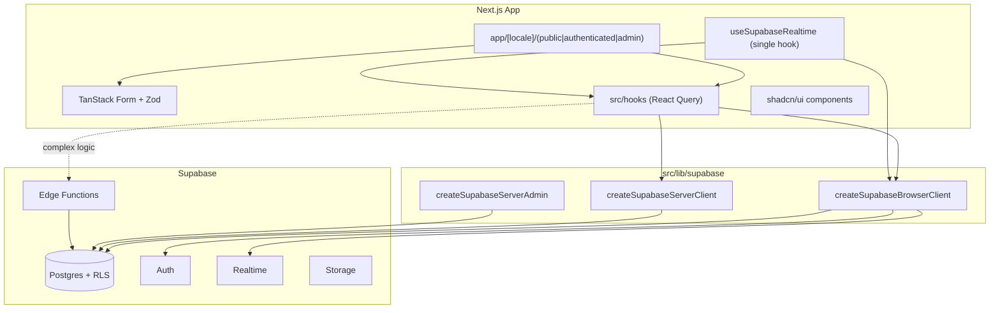

# SailingLoc — Project Overview and Guidelines

> Technical onboarding and enforcement guide for AI agents and developers working on this codebase.

---

## Rules of engagement

1. **Read this file before any work.** All conventions below are mandatory.
2. **Follow every rule.** Do not introduce patterns that contradict this document.
3. **Ask before building the unknown.** Do not implement features, UI flows, integrations, or architectural choices that are not described or implied by this file (or linked project docs) without **explicit user confirmation**. When in doubt, ask — do not assume. Do not add unrequested "helpful extras."
4. **Keep this file current.** Whenever the project changes structurally or conventionally, update `agent.md` in the **same PR/commit** so it stays accurate.

For business context (SailingLoc, team, legal disclaimer), see [README.md](README.md).  
For product requirements, see [documentation/](documentation/).

---

## Project context

**SailingLoc** is a peer-to-peer boat rental platform developed as an academic project (DEV DSP4 G3 2026). The company is fictional; no real transactions occur.

**Current state:** base Next.js 16 template. Scaffolding is in place (Supabase clients, i18n, theme, TanStack Query provider). Feature pages, data hooks, realtime, edge functions, and auth UI are **not yet implemented**.

---

## Technology stack


| Layer        | Choice                                                       |
| ------------ | ------------------------------------------------------------ |
| Framework    | Next.js 16 (App Router, React Compiler enabled)              |
| UI           | React 19, Tailwind CSS 4, shadcn/ui (`radix-nova` style)     |
| i18n         | `next-intl` — locales `en`, `fr`                             |
| Forms        | `@tanstack/react-form` + `zod`                               |
| Server state | `@tanstack/react-query` (15 min backup stale time)           |
| Backend      | Supabase (Auth, Postgres, Realtime, Storage, Edge Functions) |
| Theming      | `next-themes`                                                |


Key dependencies are in [package.json](package.json).

---

## Directory structure

```
src/
├── app/
│   ├── layout.tsx              # Root pass-through layout
│   ├── page.tsx                # Redirects to default locale
│   ├── globals.css             # Tailwind + shadcn CSS variables
│   └── [locale]/
│       ├── layout.tsx          # Providers: Query, i18n, theme, toaster
│       ├── page.tsx            # Home (Hello World)
│       ├── not-found.tsx
│       ├── (public)/           # Unauthenticated routes (empty)
│       ├── (authenticated)/    # Logged-in user routes (empty)
│       └── (admin)/            # Admin-only routes (empty)
├── components/ui/              # shadcn primitives (button, sonner)
├── contexts/                   # TanstackQueryClient, ThemeProvider
├── hooks/                      # Empty — all query/realtime hooks go here
├── i18n/                       # routing, request, navigation
├── lib/
│   ├── utils.ts                # cn() helper
│   └── supabase/               # Client factories + generated types
└── proxy.ts                    # next-intl locale routing (Next.js 16 proxy)

messages/                       # en.json, fr.json (project root)
supabase/
├── config.toml                 # Local + storage + per-function edge config
├── migrations/                 # SQL migrations
├── seed.sql                    # Local test/fixture data (not for production)
└── functions/                  # Edge functions (not yet scaffolded)
    └── <function-name>/
        ├── index.ts            # Function entrypoint
        └── deno.json           # Function-specific Deno deps (one per function)
```

**Path alias:** `@/`* → `src/*` ([tsconfig.json](tsconfig.json)).

---

## Architecture overview




---

## App routing conventions

- All user-facing routes live under `[src/app/[locale]/](src/app/[locale]/)`.
- Three **route groups** (parentheses = no URL segment):
  - `(public)` — marketing, auth pages, unauthenticated flows
  - `(authenticated)` — renter/owner dashboards, profile, bookings
  - `(admin)` — administrator-only management
- Locale handling:
  - `[src/i18n/routing.ts](src/i18n/routing.ts)` — `en` / `fr`, default `en`
  - `[src/i18n/request.ts](src/i18n/request.ts)` — loads `[messages/{locale}.json](messages/en.json)`
  - `[src/i18n/navigation.ts](src/i18n/navigation.ts)` — locale-aware `Link`, `redirect`, `useRouter`
  - `[src/proxy.ts](src/proxy.ts)` — Next.js 16 proxy (replaces deprecated `middleware.ts`) for locale detection

All UI strings MUST use `next-intl` with keys in the `messages/` JSON files. Do not hardcode user-facing text.

---

## Conventions

### Forms

- **MUST** use `@tanstack/react-form` with a `zod` schema for validation.
- Do **not** use raw `useState` for production form state.

### CRUD and data fetching

- All Supabase CRUD **MUST** go through the client factories in `[src/lib/supabase/](src/lib/supabase/)`:
  - `createSupabaseBrowserClient` — client components
  - `createSupabaseServerClient` — server components / server actions
  - `createSupabaseServerAdmin` — privileged server-only ops (`NEXT_PRIVATE_SUPABASE_ADMIN_KEY`)
- Wrap each resource in a dedicated hook under `[src/hooks/](src/hooks/)` using `@tanstack/react-query`.
- **All Supabase DB hooks MUST use `useSupabaseRealtime` for cache invalidation.** Any hook that reads or writes Supabase data must call `useSupabaseRealtime` directly, passing the query keys it manages, so that when the underlying data is modified (insert, update, delete), the hook's cached data is invalidated automatically. Do **not** write raw `supabase.channel()` subscriptions in components or data hooks, and do not use manual polling.
- **Query client defaults** (apply in `[src/contexts/tanstack-query-client.tsx](src/contexts/tanstack-query-client.tsx)`):
  - `staleTime: 15 * 60 * 1000` (15 min backup invalidation only — not the primary refresh mechanism)
  - Primary invalidation via `useSupabaseRealtime` (Postgres changes + auth events) — not polling
- **Single realtime hook** — `useSupabaseRealtime` in `src/hooks/`:
  - Called directly inside each data hook that needs invalidation (not mounted at the root layout)
  - Encapsulates all Supabase Realtime subscription logic in one place
  - Subscribes to relevant Postgres changes per table/resource
  - Listens to auth events for the current user (`SIGNED_IN`, `SIGNED_OUT`, `TOKEN_REFRESHED`, `USER_UPDATED`)
  - Calls `queryClient.invalidateQueries()` with defined query-key rules when matching data changes
  - Data hooks pass their query keys to `useSupabaseRealtime`; they do not implement Realtime subscriptions themselves
- **Query-key naming convention:**
  - `['users', userId]`
  - `['boats', 'list', filters]`
  - `['bookings', bookingId]`
  - Use a consistent `[resource, ...identifiers]` pattern

### Edge functions

Use edge functions for logic beyond simple CRUD: payments, commissions, multi-table transactions, external APIs.

- **MUST** be created and deployed via Supabase CLI.
- **Per-function `deno.json`** (mandatory): each function folder under `supabase/functions/<name>/` owns its own `deno.json`. Do **not** use a shared root `supabase/functions/deno.json` for deployment.
- **Per-function `config.toml` entry** (mandatory): every edge function **MUST** have a matching `[functions.<name>]` block in `[supabase/config.toml](supabase/config.toml)`. At minimum, set `verify_jwt` (default `true`; set `false` only for public webhooks). Add `entrypoint` or `import_map` only when deviating from the default `index.ts` / `deno.json` layout.

Example layout:

```
supabase/functions/process-payment/
├── index.ts
└── deno.json
```

Example config:

```toml
# supabase/config.toml
[functions.process-payment]
verify_jwt = true
```

**Checklist when adding a new edge function:**

1. `npx supabase functions new <name>` — scaffolds `supabase/functions/<name>/index.ts`
2. Add/edit `supabase/functions/<name>/deno.json` with that function's dependencies
3. Add `[functions.<name>]` to `supabase/config.toml`
4. Test locally: `npx supabase functions serve <name>`
5. Deploy: `npx supabase functions deploy <name>`

### Database changes

- **Only** via Supabase CLI migrations: `supabase migration new <name>` → edit SQL in `[supabase/migrations/](supabase/migrations/)` → `supabase db push` / `supabase migration up`.
- **RLS is mandatory on first creation:** any new PostgreSQL object (tables, API-exposed views) **MUST** include RLS policies in the **same migration** that creates it. Never add a table and defer policies to a follow-up migration.
  - `ALTER TABLE ... ENABLE ROW LEVEL SECURITY` in the creation migration
  - Explicit `CREATE POLICY` for each required operation (`SELECT`, `INSERT`, `UPDATE`, `DELETE`)
  - Postgres requires a `SELECT` policy for `UPDATE` to work under RLS
  - Policies MUST match the real access model (role-based, ownership via `auth.uid()`, etc.)
  - Use `SECURITY DEFINER` functions only when necessary; keep them out of exposed schemas where possible

**Checklist when adding a new table:**

1. `npx supabase migration new <name>`
2. `CREATE TABLE` + indexes/constraints
3. `ENABLE ROW LEVEL SECURITY` + all `CREATE POLICY` statements in the same file
4. Regenerate TypeScript types (see below)

**Current schema** (`[20260507115308_init_database.sql](supabase/migrations/20260507115308_init_database.sql)`):


| Table               | Description                                              | RLS                           |
| ------------------- | -------------------------------------------------------- | ----------------------------- |
| `public.users`      | Profile linked to `auth.users`                           | Users can view/update own row |
| `public.user_roles` | Role enum: `VISITOR`, `RENTER`, `OWNER`, `ADMINISTRATOR` | Users can view own role       |


Triggers: timestamp enforcement, role requirements (email + phone for elevated roles), auto-provision on auth signup/update.

After any migration, regenerate types:

```bash
npx supabase gen types typescript --schema public > src/lib/supabase/database.types.ts
```

> **Note:** [README.md](README.md) references `supabase/database.types.ts`. The canonical path in this project is `src/lib/supabase/database.types.ts`.

### Local seed data

Use `[supabase/seed.sql](supabase/seed.sql)` for **local testing only** — fixture users, sample boats, bookings, etc. Do **not** put seed data in migrations.

- Seed file is referenced in `[supabase/config.toml](supabase/config.toml)` under `[db.seed]` (`sql_paths = ["./seed.sql"]`, `enabled = true`).
- Seed runs automatically after migrations on a full local reset:

```bash
npx supabase db reset
```

- To re-apply migrations + seed without restarting the whole stack, use `db reset` (preferred for a clean local state).
- When adding tables that need test data locally, update `seed.sql` in the **same change** and respect RLS (use `service_role` via SQL or insert data in a way policies allow).
- Currently empty — add fixtures as features are built.

### Storage and other Supabase config

`[supabase/config.toml](supabase/config.toml)` is the single source of truth for non-migration Supabase config:


| Section                             | Purpose                                             |
| ----------------------------------- | --------------------------------------------------- |
| `[storage]` / `[storage.buckets.*]` | Bucket settings                                     |
| `[functions.<name>]`                | Per-function edge function config                   |
| `[edge_runtime]`                    | Edge runtime settings (enabled, `deno_version = 2`) |


Storage is enabled; no buckets configured yet. No `[functions.*]` blocks exist yet.

### UI components

- Start from shadcn CLI: `npx shadcn@latest add <component>`
- Config: `[components.json](components.json)` — style `radix-nova`, components land in `src/components/ui/`
- Customize shadcn primitives in-place; build feature components in `src/components/` (not `ui/`)

---

## Environment variables

Do **not** commit `.env` or secret keys. Required variables:


| Variable                          | Usage                        |
| --------------------------------- | ---------------------------- |
| `NEXT_PUBLIC_SUPABASE_URL`        | Supabase project URL         |
| `NEXT_PUBLIC_SUPABASE_ANON_KEY`   | Browser + server anon client |
| `NEXT_PRIVATE_SUPABASE_ADMIN_KEY` | Server admin client only     |


Obtain local values via `npx supabase status` after `npx supabase start`.

### Secrets and version control

- **Never commit** `.env`, API keys, or `NEXT_PRIVATE_SUPABASE_ADMIN_KEY`.
- **May commit** [`.env.example`](.env.example) with placeholder variable names only (not real values).
- **Supabase CLI local state** (`supabase/.temp`, `supabase/.branches`) is gitignored — do not force-add.
- **Generated types** live at `src/lib/supabase/database.types.ts` and **should be committed** after regeneration.
- **IDE local state** (`.vscode/`, `.idea/`, `.cursor/`, etc.) and **Obsidian workspace/cache** files are gitignored — personal editor and vault state must not be committed.

---

## Local development workflow

1. `npm install`
2. `npx supabase login` → `npx supabase link --project-ref <id>`
3. `npx supabase db pull` (sync remote)
4. `npx supabase start`
5. Regenerate types to `src/lib/supabase/database.types.ts`
6. Copy env vars from `npx supabase status` into `.env`
7. `npm run dev`

**Local testing with seed data:** populate `[supabase/seed.sql](supabase/seed.sql)` with fixtures, then run `npx supabase db reset` to apply migrations and seed in one step. Use this to get a repeatable local dataset for development and manual testing.

---

## Current gaps (not yet implemented)

Do **not** assume these exist. Build them when needed, following the conventions above.


| Gap                   | Location / notes                                                                                       |
| --------------------- | ------------------------------------------------------------------------------------------------------ |
| No data hooks         | `src/hooks/` is empty                                                                                  |
| No 15 min `staleTime` | `[tanstack-query-client.tsx](src/contexts/tanstack-query-client.tsx)` uses bare `new QueryClient()`    |
| No realtime hook      | `useSupabaseRealtime` not created                                                                      |
| No edge functions     | `supabase/functions/` does not exist; no per-function `deno.json`; no `[functions.*]` in `config.toml` |
| Empty route groups    | `(public)`, `(authenticated)`, `(admin)` have no pages                                                 |
| No auth UI            | No login/signup pages; no session proxy beyond Supabase client factories                               |
| Minimal shadcn        | Only `button` and `sonner` installed                                                                   |


---

## Keeping `agent.md` up to date

### Before starting work

- Read this file and follow every rule.
- If the requested work goes beyond what this file specifies (new feature, page flow, table, integration, dependency, etc.), **stop and ask the user for confirmation** before implementing.

### When making changes

Respect all conventions. Update `agent.md` in the **same change** when:


| Trigger                                            | What to update                                                                                      |
| -------------------------------------------------- | --------------------------------------------------------------------------------------------------- |
| New directory, route group, or architectural layer | Directory structure + architecture diagram                                                          |
| New Supabase table / migration                     | Database schema summary; update `seed.sql` if local fixtures needed; remove from gaps if applicable |
| New edge function                                  | Edge functions section; `config.toml` / `deno.json` examples                                        |
| New hook pattern or query-key convention           | CRUD / realtime section; register keys in `useSupabaseRealtime`                                     |
| New env variable                                   | Environment variables table                                                                         |
| New shadcn component or UI convention              | UI components section                                                                               |
| Convention added or changed                        | Conventions section                                                                                 |
| Feature implemented that was listed under gaps     | Remove or update the gap entry                                                                      |


### After completing work

- Verify the change complies with all rules in this file.
- Verify `agent.md` still reflects the current project state (no stale paths, missing entries, or outdated "not implemented" notes).

